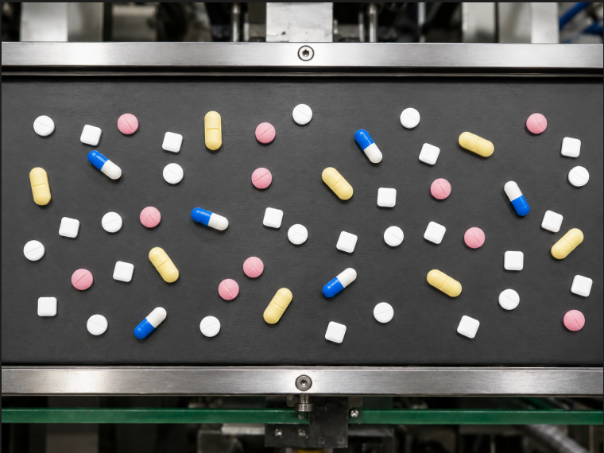
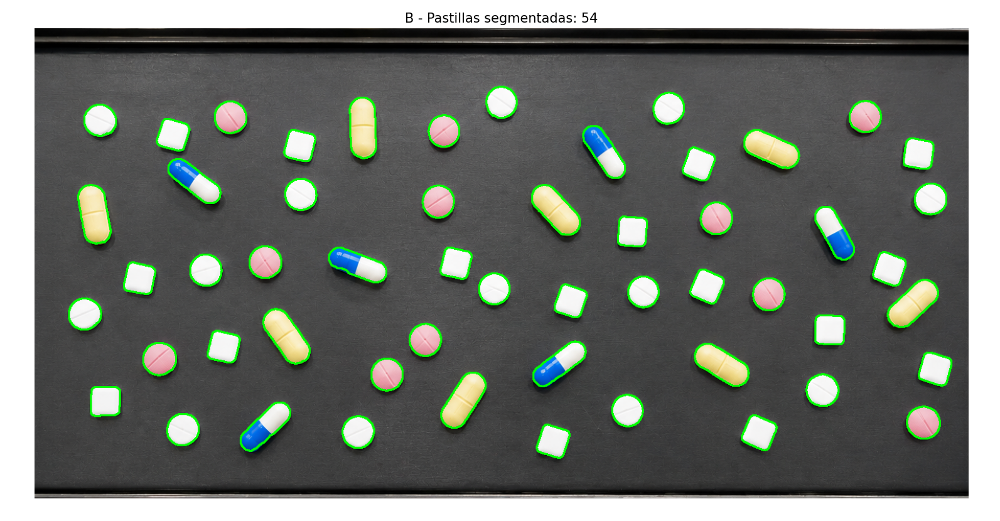
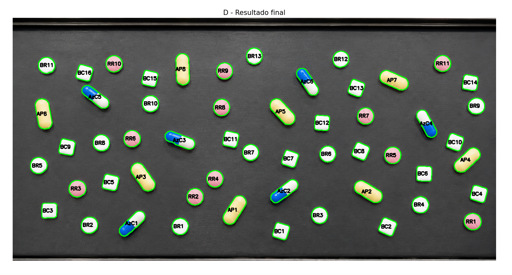

# TP2 — Detección y Clasificación de Pastillas en Cinta Transportadora

**Materia:** Procesamiento Digital de Imágenes I  
**Carrera:** Tecnicatura Universitaria en Inteligencia Artificial (TUIA) — UNR  

---

## Descripción del problema

Se dispone de una imagen de una cinta transportadora industrial con pastillas de distintos tipos mezcladas sobre un fondo oscuro. El objetivo es, sin usar deep learning ni OCR externo, **detectar**, **segmentar** y **clasificar automáticamente** cada pastilla por tipo, reportando la cantidad de cada uno.

Los cinco tipos de pastillas presentes son:

| Código | Descripción |
|--------|-------------|
| `BR` | Blanca Redonda |
| `BC` | Blanca Cuadrada |
| `AP` | Amarilla (cápsula) |
| `RR` | Rosada Redonda |
| `AzC` | Azul-Celeste (cápsula mitad azul, mitad blanca) |

---

## Pipeline de procesamiento

El pipeline se divide en cuatro etapas:

### A — Detección de ROI (región de interés)

La imagen contiene el marco metálico de la cinta, que no es relevante para el análisis. La ROI se detecta **automáticamente** sin valores hardcodeados:

- Se calcula el perfil de intensidad promedio por fila (`np.mean` sobre el eje horizontal).
- Se suaviza con un promedio móvil de ventana 20 para eliminar variaciones pequeñas.
- Se calcula la derivada discreta del perfil suavizado.
- El borde superior es la caída más brusca en la primera mitad (metal brillante → cinta oscura).
- El borde inferior es la subida más brusca en la segunda mitad (cinta oscura → metal brillante).

### B — Segmentación de pastillas

Con la ROI recortada, se separan las pastillas del fondo oscuro:

- Conversión a HSV y extracción del canal **V** (brillo). Las pastillas son objetos brillantes sobre fondo oscuro, por lo que V es el canal más discriminativo.
- Umbral dinámico basado en **percentil 88** del canal V. Esto equivale a "el 12% más brillante de la cinta son pastillas", adaptándose a variaciones de iluminación entre imágenes.
- Cierre morfológico con kernel elíptico 5×5 para rellenar huecos internos causados por reflejos.
- Filtrado de contornos por:
  - Área mínima: 0.14% del área de la ROI (derivado del tamaño relativo de una pastilla).
  - Relación de aspecto: se descartan contornos con `w/h > 10` (bordes horizontales de la ROI).

### C — Clasificación por color y forma

#### Clasificación por color (LAB + HSV)

Cada pastilla se clasifica individualmente usando sus propios promedios en espacio **CIELAB** y **HSV**:

- **Canal A** (eje verde–rojo): `A > 140` → rosada (`RR`)
- **Canal B** (eje azul–amarillo): `B > 138` → amarilla (`AP`); `B < 120` → azul (`AzC`)
- Si A y B son neutros: se valida con HSV que `V > 120` y `S < 60` → blanca

Se eligió CIELAB porque el canal L (luminosidad) está desacoplado de los canales cromáticos, lo que hace la clasificación robusta frente a variaciones de iluminación. Se descartó K-means por su aleatoriedad en la inicialización de centroides.

#### Clasificación por forma (solo blancas)

Las pastillas blancas se subdividen en redondas y cuadradas usando la **circularidad geométrica**:

```
circularidad = 4 * π * área / perímetro²
```

- Círculo perfecto → 1.0
- Cuadrado ideal → π/4 ≈ 0.785
- Umbral aplicado: `circularidad > 0.88` → `BR`, sino → `BC`

Se descartó K-means sobre circularidades por la misma razón: resultados no determinísticos. El umbral fijo es justificable geométricamente.

### D — Resultado final

Se genera una imagen con contornos verdes y etiquetas `TIPO + ID` sobre cada pastilla, y se reporta el conteo por tipo por consola.

---

## Problemáticas encontradas y soluciones

### Umbral de segmentación dependiente de la imagen

**Problema:** un umbral fijo en el canal V (originalmente `110`) fallaba cuando la imagen tenía condiciones de iluminación distintas.  
**Solución:** reemplazar el valor fijo por el **percentil 88** del canal V calculado sobre la ROI. El umbral se adapta automáticamente a cada imagen.

### Clasificación por color no determinística con K-means

**Problema:** K-means con `K=4` sobre colores promedio LAB producía resultados distintos en cada ejecución por la inicialización aleatoria de centroides. Además, requería una función extra para interpretar los centros resultantes.  
**Solución:** clasificación determinística pastilla por pastilla usando umbrales directos sobre los canales A y B de CIELAB, validando con HSV para las blancas. Mismo resultado en cada ejecución, sin aleatoriedad.

### Separación blancas redondas vs cuadradas con K-means

**Problema:** K-means sobre circularidades también era no determinístico y podía invertir los grupos entre ejecuciones.  
**Solución:** umbral fijo de circularidad `0.88`, justificado geométricamente: los valores ideales son `1.0` para círculos y `0.785` para cuadrados, con `0.88` como separador natural entre ambos grupos.

### Pastillas azul-celeste con canal B cercano al neutro

**Problema:** las cápsulas AzC son mitad blancas y mitad azules. El promedio del canal B no cae tan por debajo de 128 como en un objeto completamente azul.  
**Solución:** umbral asimétrico: `B < 120` (en lugar de `< 128`) para capturar el desplazamiento parcial del promedio hacia el azul.

---

## Resultados







### Conteo obtenido

| Tipo | Cantidad |
|------|----------|
| BR — Blanca Redonda | 13 |
| BC — Blanca Cuadrada | 16 |
| AP — Amarilla (cápsula) | 8 |
| RR — Rosada Redonda | 11 |
| AzC — Azul-Celeste | 6 |
| **TOTAL** | **54** |

---

---

---

# Parte B — Detección de Patentes Mercosur en Imágenes de Tráfico

## Descripción del problema

Se dispone de 12 fotografías de vehículos tomadas en condiciones reales de tráfico (distintas iluminaciones, ángulos, distancias y calidades). El objetivo es **localizar automáticamente la patente** en cada imagen y **segmentar los 7 caracteres** que la componen, sin usar deep learning ni OCR externo.

El target son patentes argentinas formato Mercosur: fondo blanco, franja azul superior con la inscripción "REPÚBLICA ARGENTINA", y 7 caracteres en formato `AA 000 BB`.

---

## Pipeline de procesamiento

### 1 — Carga y redimensionado

Todas las imágenes se redimensionan para que su lado más largo mida **800 px**, manteniendo la relación de aspecto. Esto normaliza el procesamiento y elimina la dependencia del tamaño original de cada foto.

### 2 — Preprocesamiento y detección de bordes

Se aplica la siguiente cadena:

- **Gaussian Blur (3×3):** suaviza ruido fino antes del sharpening.
- **Sharpening (kernel Laplaciano):** realza los bordes de los caracteres y el marco de la patente.
- **Gaussian Blur (5×5):** suprime el ruido amplificado por el sharpening antes de Canny.
- **Canny (100, 200):** extrae los bordes finales.

### 3 — Extracción y filtrado de candidatos

Se detectan contornos en la imagen de bordes y se filtran por dos criterios geométricos derivados de las dimensiones reales de la patente Mercosur:

- **Ratio ancho/alto:** entre 2.0 y 4.5 (la patente real tiene ratio ~3.08).
- **Área relativa:** entre 0.5% y 5% del área total de la imagen.

### 4 — Sistema de scoring (4 criterios)

Cada candidato recibe entre 0 y 4 puntos:

| Criterio | Descripción |
|----------|-------------|
| **+1 ratio** | Distancia al ratio ideal 3.08 menor a 0.5. Si el ángulo supera 15°, se usa el ratio corregido con `minAreaRect`. |
| **+1 blanco+negro** | El ROI contiene al menos 35% de píxeles blancos y 10% de píxeles negros simultáneamente. |
| **+1 caracteres** | Dentro del ROI se detectan entre 3 y 7 contornos con forma de carácter (ratio alto/ancho entre 1.2 y 2.5, área relativa entre 4% y 20%). |
| **+1 franja azul** | La franja superior (20% del alto del candidato) contiene al menos 25% de píxeles en el rango HSV del azul Mercosur `[100–130, 80–255, 50–255]`. |

### 5 — Detector alternativo (fallback)

Si el puntaje máximo del detector principal es menor a 2, se activa un **detector alternativo** basado en umbralización adaptativa en lugar de Canny. Este segundo detector aumenta la tolerancia geométrica y se puntúa con los mismos 4 criterios. Si mejora el resultado, reemplaza al candidato principal.

### 6 — Segmentación de caracteres

Sobre el crop ganador se aplica umbralización adaptativa gaussiana y se filtran los contornos resultantes por ratio y área para identificar los 7 caracteres. Se itera sobre múltiples valores de `blockSize` y se selecciona el resultado más cercano a 7 caracteres detectados.

---

## Problemáticas encontradas y soluciones

### Variación de iluminación entre imágenes

**Problema:** imágenes tomadas de noche, con contraluz, en estacionamiento o en pleno día tenían distribuciones de intensidad completamente distintas. Un umbral fijo en Canny fallaba en varios casos.  
**Solución:** pipeline de preprocesamiento con sharpening antes de Canny para realzar bordes independientemente de la iluminación global, y detector alternativo con umbralización adaptativa como fallback.

### Patentes con bajo puntaje por ratio incorrecto

**Problema:** patentes fotografiadas con ángulo producían contornos con ratio distorsionado que no coincidía con el ratio ideal 3.08.  
**Solución:** corrección de ratio usando `cv2.minAreaRect` cuando el ángulo del contorno supera los 15°.

### Fusión de la patente con la carrocería

**Problema:** en algunos vehículos claros, la patente blanca se fusionaba con la carrocería en la imagen de bordes, produciendo contornos más grandes que cubrían ambas regiones.  
**Solución:** el criterio de franja azul actúa como discriminador: la carrocería no tiene la franja HSV característica de la patente Mercosur.

### Segmentación de caracteres variable según imagen

**Problema:** un único valor de `blockSize` en la umbralización adaptativa no funcionaba para todas las imágenes (distintas resoluciones y contrastes del crop).  
**Solución:** iteración sobre múltiples valores de `blockSize` y selección del resultado cuyo conteo de contornos sea más cercano a 7.

---

## Resultados

**10 de 12 imágenes** con localización correcta de la patente y segmentación de 7 caracteres.

### Ejemplos de detecciones exitosas


---

## Estructura del repositorio

```
PDI-TP2/
├── Deteccion_pastillas.py   # pipeline parte A — pastillas
├── detec_pat_edit.py        # pipeline parte B — patentes
├── pills.png                # imagen de entrada (pastillas)
├── img_1.jpg                # imágenes de vehículos (img_1 a img_12)
├── ...
├── patentes/                # capturas de resultados parte B
│   ├── img_1_resultado.png
│   └── ...
├── resultado_B.png          # captura paso B (pastillas)
├── resultado_D.png          # captura paso D (pastillas)
└── README.md
```

---

## Dependencias

```
opencv-python
numpy
matplotlib
```

Instalación:
```bash
pip install opencv-python numpy matplotlib
```

Ejecución — Parte A (pastillas):
```bash
python Deteccion_pastillas.py
```

Ejecución — Parte B (patentes):
```bash
python detec_pat_edit.py
```

---

## Decisiones de diseño generales

- **Sin valores hardcodeados de píxeles:** todos los umbrales se derivan de propiedades de la imagen (percentiles, proporciones relativas) o de geometría formal (ratio real de la patente Mercosur, circularidad ideal de círculo/cuadrado).
- **Sin deep learning ni OCR externo:** ambos pipelines usan únicamente OpenCV, NumPy y Matplotlib.
- **Clasificación determinística:** se priorizó la reproducibilidad sobre la generalidad, eligiendo reglas explícitas sobre clustering aleatorio.
- **CIELAB sobre RGB para color:** el desacople de luminosidad hace que las reglas cromáticas sean robustas frente a cambios de iluminación.
- **Fallback por detector alternativo:** ante imágenes difíciles, el sistema intenta una estrategia secundaria en lugar de fallar silenciosamente.
